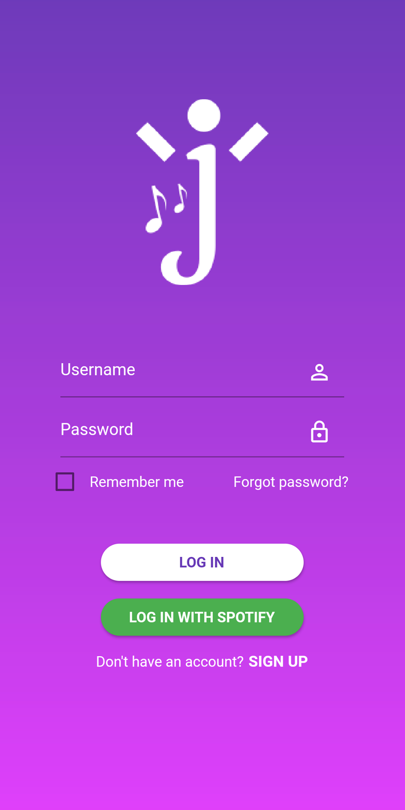
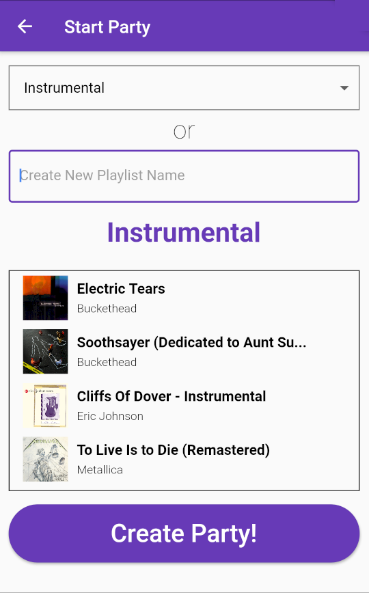
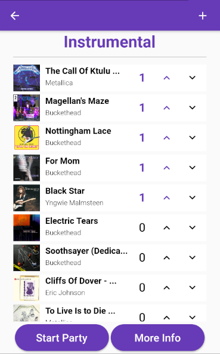
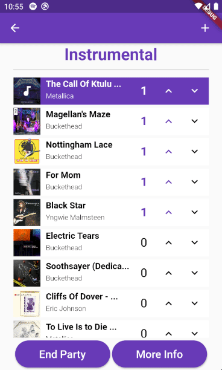
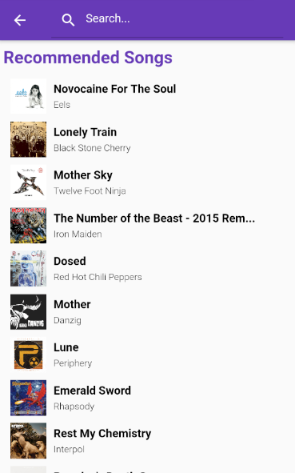
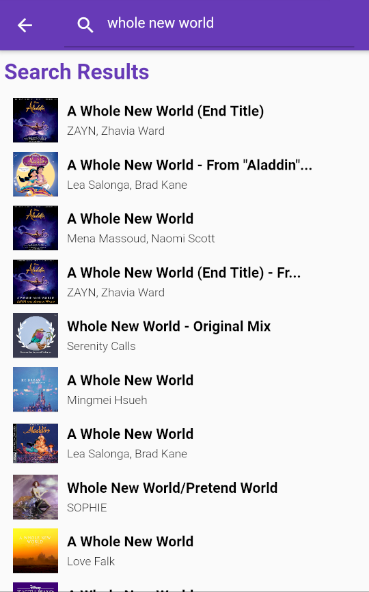
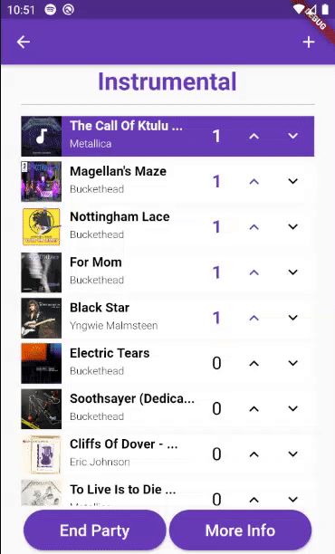
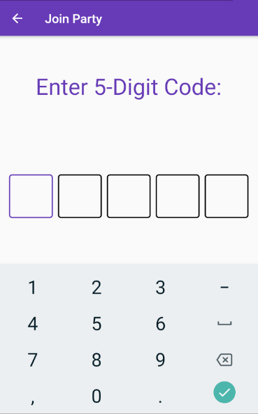

# Jashan
&lt;Juh-shuhn> A playlist collaboration app that allows people who are in close proximity to curate a music playlist together on a host phone in real-time.

<p float="middle">
  
   
   
  
  
  
  
  
</p>

## A New Experience
Everyone has a unique music taste. When you are by yourself, you tend to listen to songs that fit your specific music taste. But there's a whole world of music out there that you have never experienced! Discovering songs with friends is not only an incredibly fun way to bond with others, but it is also a refreshing change in perspective!

## Music For All
Whether your group is a few people on a road trip or hundreds at a party, Jashan makes sure that everyone has a great time.

#### Integrated with Spotify
Search for Spotify songs within Jashan and add them to the host's playlist. Only the host needs Spotify Premium.

#### Voting System
Upvote songs you want to see played next for the group and downvote those that you don't.

#### Smart Suggestions
Add songs the entire group will enjoy rather than just a few people through our novel recommendation algorithm.

#### Social Network
Find people at parties with similar music interests. Go to upcoming parties with them.

## Connect with Other Music Lovers
We give you similarity scores with others in your group so you can find those who share your music preferences. After adding friends to your account, you can plan Jashan parties in advance and invite friends to join you!

## Setup

The following are requirements to run the Jashan app:

- [Flutter](https://flutter.dev/docs/get-started/install)
- [Android SDK](https://developer.android.com/studio#downloads) (if using Android to run)
    - Download the "Command line tools only," unless one wishes to use Android Studio to develop (recommended if one 
    doesn't have IntelliJ Ultimate)
- [Gradle](https://gradle.org/install/) (if using Android to run)
    - [Java](https://www.java.com/)
- [Xcode](https://developer.apple.com/xcode/) (if using iOS to run)

After installing the tools, run the following command to check if Flutter is installed properly:
```
flutter doctor
```
Resolve all problems found.

### If Using Android to Run

**Setting up Firebase**

A Firebase database for Android is a requirement to run Jashan. Note that
steps may be taken for each operating system. That is, following these
steps does not allow for the iOS application to run.

On the Firebase Console, select `Add App`. Then, select Android
as the platform. For the Android package name, enter `com.jashan.app.jashan`.
Then, after filling any optional data fields, click `Register app`.

Download the configuration file and place the file in the `android/app/` folder.
Ensure that the `.gitignore` ignores the JSON file.

You have set up Firebase for Android!

**Setting up the Android simulator**

After installing the tools, set up a device using the AVD Manager. Then, run the AVD instance.

After the AVD instance sets up, run the following command:

```
flutter run
```

### If Using iOS to Run

**Setting up Firebase**

A Firebase database for iOS is a requirement to run Jashan. Note that
steps may be taken for each operating system. That is, following these
steps does not allow for the Android application to run.

On the Firebase Console, select `Add App`. Then, select iOS
as the platform. For the iOS bundle ID, enter `com.jashan.app.jashan`.
Then, after filling any optional data fields, click `Register app`.

Download the configuration file. Open the `ios/runner.xcworkspace` 
directory with Xcode, then drag the plist file into the `Runner/Runner` 
directory. Ensure the `.gitignore` ignores the `GoogleService-Info.plist` 
file.

You have set up Firebase for iOS!

**Setting up the iOS simulator**

After installing the tools, set up a device using the Simulator application. Then, run the Simulator.

After the Simulator is set up, run the following command:
```
flutter run
```

#### IDEs

Use either one of the following:

- [IntelliJ Ultimate](https://www.jetbrains.com/idea/) - [guide](https://flutter.dev/docs/get-started/editor?tab=androidstudio)
    - [Android Studio](https://developer.android.com/studio#downloads) if one cannot use IntelliJ Ultimate - [guide](https://flutter.dev/docs/get-started/editor?tab=androidstudio)
- [Visual Studio Code](https://code.visualstudio.com/) - [guide](https://flutter.dev/docs/get-started/editor?tab=vscode)
- [Emacs](https://www.gnu.org/software/emacs/download.html) - [guide](https://flutter.dev/docs/get-started/editor?tab=emacs)

### Setting up Google Firebase

Once the application is set up in an IDE, it is ready to be set up with
Firebase. To do so, . Then, create
either an Android project, an iOS project, or both. Follow the 
